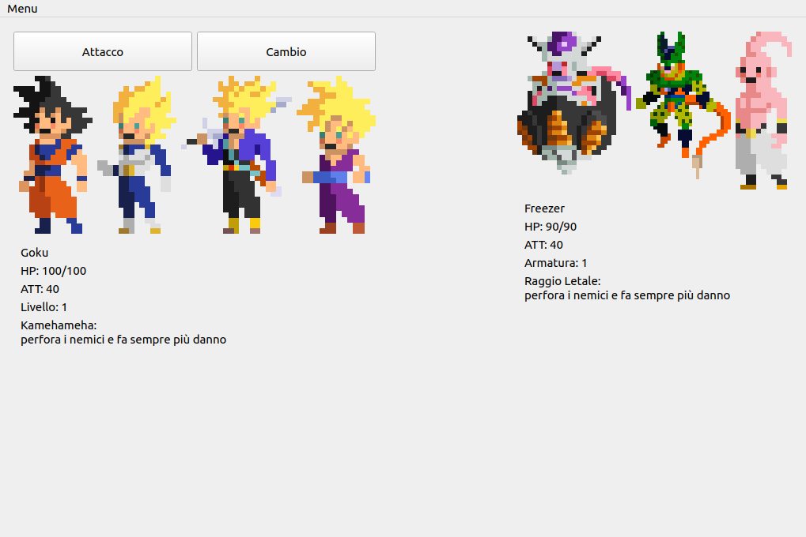

# DragonBallQ
Project for the Object Oriented Programming course at the University of Padua.

Simple video game inspired by the Dragon Ball series, done in C++ and Qt.

<p></p>

## Requirements
- C++ compiler
- make, qmake
- Qt framework

## Instruction
1. Clone the repository:
   
    ```
    git clone https://github.com/G4utama/DragonBallQ.git
    ```
3. Compile the code and wait for it to finish:
   
    ```
    cd DragonBallQ
    qmake
    make
    ```
5. Run the game:
   
    ```
    ./DragonBallQ
    ```

## Notes
The program has been tested on Ubuntu, it is not guaranteed to work on other OS
